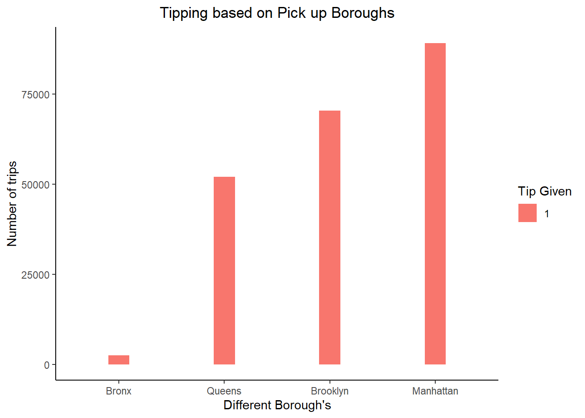
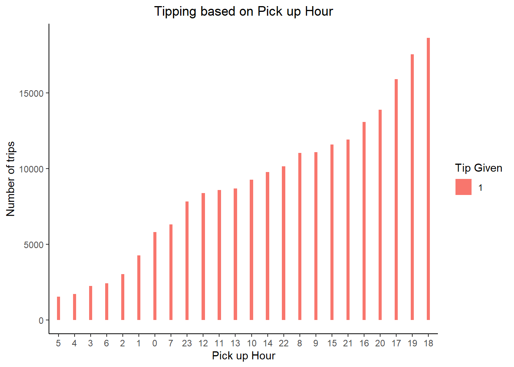
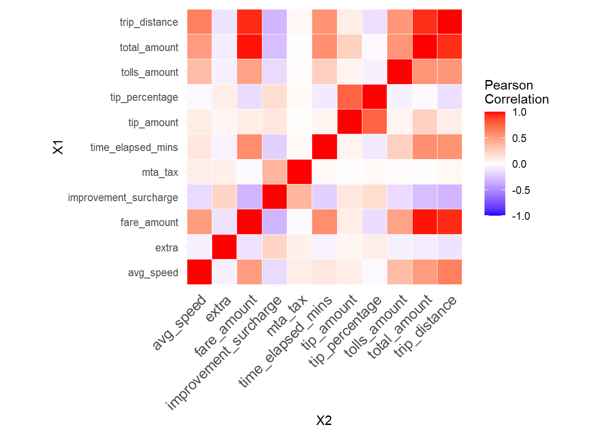

# Green Taxi Tip Classifier Model : Project Overview :
* Created a tool based on a classifer model which could predict if a taxi ride in NYC would be able to secure tips based on a number of factors 
* Used [Data](https://s3.amazonaws.com/nyc-tlc/trip+data/green_tripdata_2019-01.csv) from January 2019 from NYC open data
* Also added [taxi zones](https://s3.amazonaws.com/nyc-tlc/misc/taxi+_zone_lookup.csv) data , in order to be able to get the borough where the taxi operated
* Engineered Features from the data : speed of taxi , distance travelled ,pick up /drop off hours , location of pickup /drop
* Used random forest model to classify if tips were secured 

## Code and Packages Used 
* *R Version :* 4.0.5 
* *Packages:* mlbench, tidyverse, ggplot2, caret, lubridate, olsrr, randomForest, cowplot, tidymodels, parsnip, reshape, pROC, ggeasy

## Data Cleaning 
After getting the data from the webisite and merging the two data sets , I made the following changes and created the following variables :
* Removed negative values of all distances of trip , trip cost,fare ,etc
* Limited passgeners to 6
* Removed two columns eHail and store and forward flags since they had over 99% Null enteries
* Created variables :
    * pick up hour
    * drop off hour 
    * pick up borough(s)
    * drop off borough(s)
* Transformed all variables to the right data types 

## EDA 
Below are few hilights of the EDA done on the data sets 

  
  
  
  
## Model Building
First, I transformed the categorical variables into factors. I also split the data into train and tests sets with a test size of 15%.

I tried to first predict the actual price of the tip of the taxi , upon relalizing these models perfomed poorly , i stuck to doing a classifer model to just predict if a tip was secured or not .Just a simple 1 for if tip was given and 0 if tip was not given for that trip .

Random Forest – Since , the data had a lot of varibables which are factors , I that this would be a good fit.
  
## Model performance:
 * Accuracy:88%
 * Kappa 75%

## Conclusion:
So in the end we can conclude that the taxi driver would be able to most tips if he / she followed the following steps :

1. Picked up and dropped off a passenger in and around Manhattan
2. Worked during the peak rush hours of 6-7 pm in the evenings
3. Accepted payments in credits cards rather than cash
4. Accepted rides within a 30 miles radius of their pickup locations While we cannot say these factors will always lead to the taxi ride getting tips , these factors might prove to help the taxi driver secure a tip from the passenger

